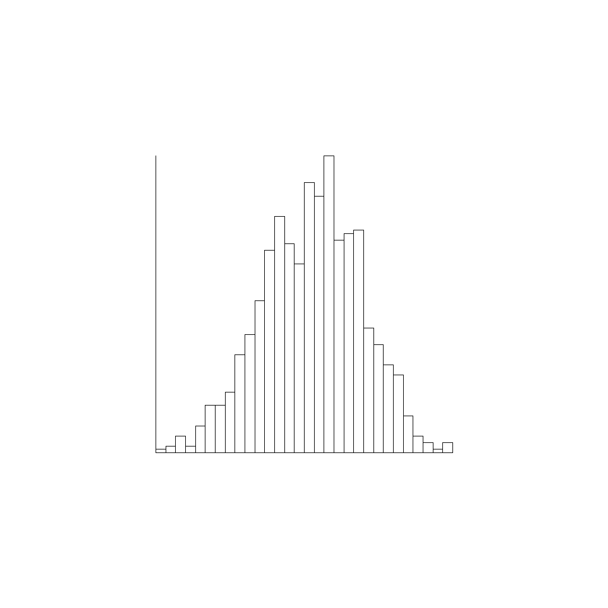
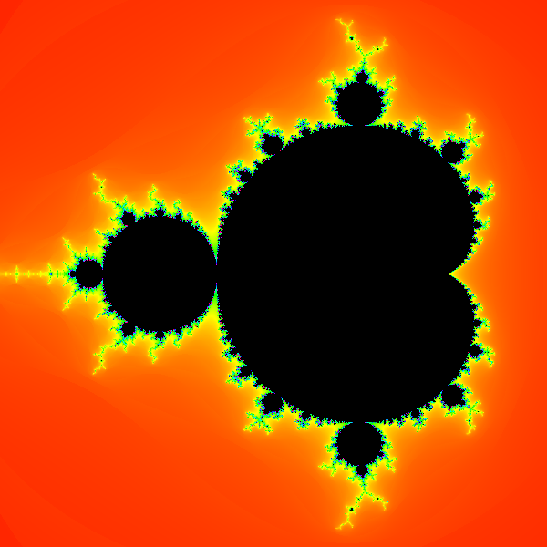


# Übungen 4

### Tutoren

[matthias.amberg@unibas.ch](mailto:matthias.amberg@unibas.ch)

### Foren-Austausch

Wir können uns für die Übungen auch mittels des offziellen [GymInf Moodle Forum](https://moodle.unifr.ch/mod/forum/view.php?id=673384) 
austauschen. 

### Übungs-Hilfsdateien

Bitte verwenden Sie die Vorlagen im [Zipfile zu den Übungen](https://github.com/unibas-marcelluethi/gyminf-programmieren/raw/master/docs/block4/uebung4.zip)

### Allgemeine Hinweise

* Wir empfehlen Ihnen, dass Sie im Buch "Sprechen Sie Java" bis und mit Kapitel 9 lesen.
* Wechseln Sie in den Ordner _src/main/java_. Dort finden Sie die Dateien, in welche Sie ihren Java Code schreiben.
* Schreiben Sie ihr Programm, kompilieren Sie dieses mit dem Java Compiler javac und führen Sie es mit java aus, wie es in der Vorlesung gezeigt wurde.
* Wenn Sie denken, dass alles in Ordnung ist, wechseln Sie zurück ins Übungsverzeichnis _uebung3_ und führen da _gradlew test_ aus um zu überprüfen ob Ihre Lösung die automatisierten Tests besteht. Überprüfen Sie auch Ihren Codestil mit _gradlew checkstyleMain_.

## Hinweis zum Aufbau dieses Übungsblattes
 
In dieser Aufgabe entwickeln wir unser eigenes Programm um Histogrammplots zu erstellen
(Beispiele solcher Plots nden Sie am Ende dieses Übungsblatts). Dabei lernen Sie, wie Sie mit
Klassen und Objekten arbeiten und wie Sie komplexe Funktionalität aus einfachen Teilen
zusammensetzen können. In den ersten Teilaufgaben entwickeln Sie die einzelnen Teile. In der
letzten Aufgabe werden Sie diese dann zusammensetzen.

> :warning: In dieser Aufgabe können nicht alle Aufgaben durch automatisierte Tests überpüft
werden. Zum Testen der Aufgaben, die Graken produzieren, schauen Sie ob die Graken den
Vorgaben entsprechen.

## Aufgabe 1 - Punkt

Im Verzeichnis _src/main/java/_ nden Sie die Klasse Point, welche einen Punkt im
Raum durch die Raumkoordinaten (x, y) repräsentiert. Implementiere Sie die fehlenden
Teile dieser Klasse.

>:point_up: Schreiben Sie eigene kleine Testprogramme in der main Methode, um Ihre Implementation zu testen. Wenn alles funktioniert, nutzten Sie auch die mitgelieferten Tests.
Mit _gradlew test --tests PointTests_ können Sie nur die Tests für diese Klasse
ausführen.

## Aufgabe 2 - Grasche Elemente

Im Verzeichnis _src/main/java_ nden Sie die Klassen Rectangle und PlotAxes.
Diese sollen es erlauben, durch das Angeben eines Referenzpunktes sowie der Länge und
Höhe jeweils ein Rechteck respektive die Achsen eines Koordinatensystems zu zeichnen
(siehe Bild unten).

Implementieren Sie die fehlenden Methoden und testen Sie ihr Programm. Nutzen Sie dazu
die statische Methode _TurtleUtils.SetTurtlePosition_ um die  Methode _SetTurtlePosition_ aufzurufen, welche in der Klasse _TurtleUtils_ implementiert ist.

> :alert: Beim Kompilieren der Programme müssen Sie die Turtle Bibliothek wieder einbinden, wie bei den vorherigen Aufgaben wo mit der Turtle gearbeitet wurde.

Koordinatenachse

{:width="50%"}

Rechteck

{:width="50%"}

## Aufgabe 3 - Histogram

Im Verzeichnis _src/main/java/_ nden Sie die Klasse Histogram. Der Zweck dieser Klasse ist es, ein Array von Werten entgegenzunehmen und zu zählen, wie viele der
Werte in Klassen (genannt Bins) fallen. Die Klassen werden durch Intervalle fester Länge
deniert.

Implementieren Sie die fehlenden Methoden. Beginnen Sie dabei mit den Methoden _getMinValue_
und _getMaxValue_, da Sie diese in den anderen Methoden brauchen werden. Die Kommentare im Code beschreiben genauer was die jeweiligen Methoden machen.

>:point_up: Schreiben Sie eigene kleine Testprogramme in der Main-methode um Ihre Implementation zu testen. Wenn alles funktioniert nutzten Sie auch die mitgelieferten Tests.

## Aufgabe 4 - Plotten des Histogram

Schlussendlich implementieren Sie die fehlenden Methoden in der Klasse _HistogramPlot_.
Diese Klasse soll die Klassen Histogram, Rectangle und PlotAxes nutzen, um für
ein gegebenes Array von Zahlen das Histogram zu plotten. Testen Sie ihr Programm. Der
in der Main-Methode mitgegebene Testcode sollte Plots generieren, die ungefähr wie diese
im Bild aussehen.

Einfacher Testfall

Komplexter Testfall

## FREIWILLIG: Aufgabe 4a - Farbige Grafiken

Diese Aufgabe ist freiwillig. Können Sie das Programm so anpassen, dass die Balken der
Histogramme farbig gezeichnet werden? Nutzen Sie dazu die Methode _fill_ von Turtle.

## Aufgabe 5 - Mandelbrotmenge

In dieser Aufgabe schreiben Sie ein Programm, dass die
Mandelbrotmenge darstellt. Die Mandelbrotmenge ist definiert, als die Teilmenge
der komplexen Zahlen $c$, für die die Folge $z_0=0, z_{n+1} = z_{n}^2 + c$
beschränkt ist. Das heisst die Mandelbrotmenge besteht aus den Zahlen, für die
es eine Konstante $k$ gibt, so dass alle Elemente der Folge $z_n(c)$ kleiner
$k$ sind.

$
  \{ c \in \mathbb{C} \mid \exists k \forall n: z_n < k \text{ mit } z_0=0, z_{n+1}=z_n^2+c\}
$

Man kann diese Menge darstellen, indem man die zu ihr gehörenden Punkte der
komplexen Zahlenebene einfärbt. Um die obige Definition für eine gegebene
Zahl $c$ zu testen, müsste man **alle** Elemente der Folge $z_n$
betrachten, was in der Praxis natürlich nicht möglich ist. Darum stellen
wir stattdessen die "Fluchtgeschwindigkeit" der Folge $z_n(c)$ dar. Die
"Fluchtgeschwindigkeit" definieren wir als das kleinste $n$ von $z_n(c)$, so
dass $|z_n(c)| > 2$. 

Im Verzeichnis _src/main/java_ finden Sie die Klasse _Mandelbrot_. Implementieren
Sie die Methode _computeMandelbrot_, welche für eine gegebene Zahl die Mandelbrot
Folge berechnet und ein Resultatobjekt zurückgibt, welches die Resultate der Berechnung
enthält. Testen Sie Ihr Programm mit den mitgelieferten Tests.

## Aufgabe 6 - Visualisierung der Mandelbrotmenge

In dieser Aufgabe visualisieren Sie die Mandelbrotmenge. Dafür implementieren Sie die
Methode _createMandelbrotVisualization_. Dafür laufen Sie über die Pixel eines
Bildes, und ordnen jedem Pixel eine komplexe Zahl mit der Methode
_pixelPosToComplexNumber_. Berechnen Sie dann die Mandelbrotfolge mit der in der
vorigen Aufgabe implementierten Methode und nutzen Sie die Hilfsklasse _ColorPalette_
um eine Farbe entsprechend der Berechnung auszuwählen.
Wenn Sie das Programm kompilieren und mit den in der Main-Methode angegebenen
Parametern ausführen, sollten Sie etwa folgendes Bild erhalten

## Aufgabe 5 - Color Klasse

Implementieren Sie die Methode _ColorPalette.colorToGreyscale_. Diese soll eine Farbe, wie die von _ColorPalette.getColor_ zurückgegeben wird, in Graustufen
umwandeln. Dies schaffen Sie, indem die R G B Komponente der Farbe jeweils durch das
gewichtete Mittel R ∗ 0.2989 + G ∗ 0.5870 + B ∗ 0.1140 ersetzt wird.

Lesen Sie die Dokumentation der Klasse Color um die richtigen Methoden der Klasse Color zu finden: <https://docs.oracle.com/en/java/javase/11/docs/api/java.desktop/java/awt/Color.html>.

Testen Sie Ihre Implementation mit den mitgelieferten Tests.

Visualisieren Sie nun die Mandelbrotmenge auch als Graustufenbild.

## Automatisiertes Testen der Übungen / Infos zu 'gradlew'

Sie können diese Aufgaben wie schon besprochen manuell mit _javac_ und _java_ kompilieren und ausführen. Wir stellen Ihnen aber eine Test-Suite zur Verfügung, mit denen Sie Ihre Lösung bis zu einem gewissen grad selbständig überprüfen können. Falls Sie das automatisiert testen möchten, lesen Sie bitte die [Kurzanleitung](../block1/kurzanleitung-gradle.md)
