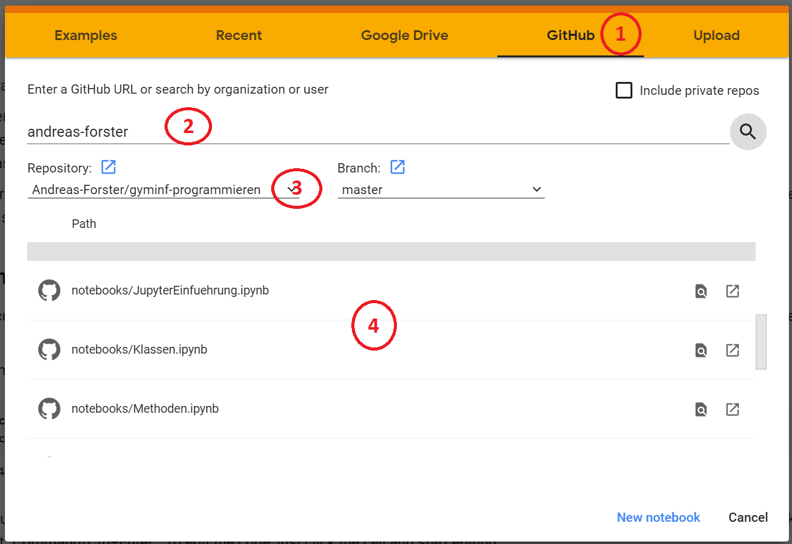

## Anleitung für Jupyter-Notebooks in Google-Colab

Google Colab sind im Grunde nichts anderes als Jupyter Notebooks welche in einer Cloud, also auf Servern ausgeführt werden. Sie können mit den Notebooks über den Browser wie mit einer Webseite interagieren. Die Umgebung ist kostenlos, Sie müssen sich jedoch mit einem Google Konto anmelden um die Notebooks nicht nur anzusehen, sondern auch ausführen und speichern zu können. Gespeichert werden die Notebooks dann in Ihrem Google-Drive. 

Um ein Notebook zu öffnen gehen sie auf die Internetseite von [Google Colab](https://colab.research.google.com). Dann sollte der unten angezeigte Dialog erscheinen. Wenn dies nicht der Fall ist, dann gehen Sie auf `File` > `Open Notebook`.

Befolgen Sie die vier Schritte:

1. Wählen Sie GitHub aus.
1. Geben Sie `Andreas-Forster` ein und drücken `Enter` oder klicken mit der Maus auf die Lupe.
1. Wenn nicht schon ausgewählt, wählen Sie das Repository `Andreas-Forster/gyminf-programmieren`.
1. Klicken Sie auf den Namen des Notebooks Ihrer Wahl in der unten erscheinenden Liste.

