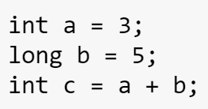
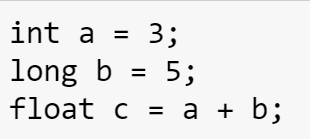
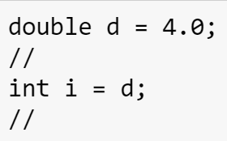
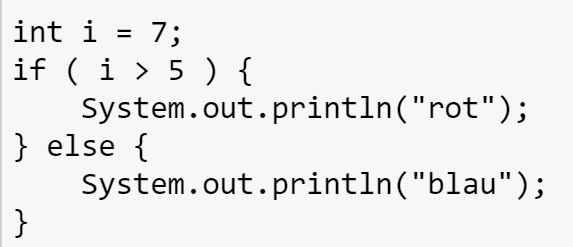
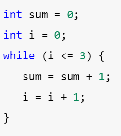
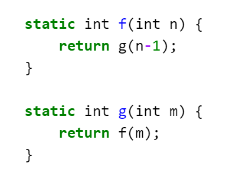
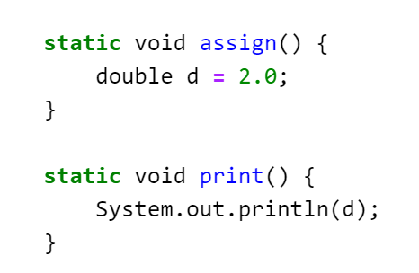
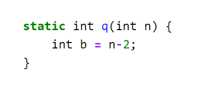

# Fragen von Kahoot

## Übersicht

* [Runde 1](#Runde-1)
* [Runde 2](#Runde-2)
* [Runde 3](#Runde-3)
* [Runde 4](#Runde-4)
* [Runde 5](#Runde-5)

## Runde 1
* Bei der Von Neumann  Archtitektur werden das Programm sowie die Daten genau gleich im selben Speicher abgelegt.
    * Richtig
* Was bedeutet ***statisch typisiert***?
    1. Variablen haben einen fixen Typ und Wert.
    2. Variablen haben einen fixen Typ.
    3. Alle Typen von Variablen sind durch die Programmiersprache vorgegeben.
    4. Beim Kompilieren ist der Typ jeder Variable bekannt.
    * 2 und 4

* Welches sind die zwei Gleitkommazahlen in Java?
    1. Double
    2. Long
    3. Int
    4. Float
    * 1 und 4

* Was ist die binäre Zahl für die 12?
    1. 1110
    2. 0101
    3. 0111
    4. 1100
    * 4

* Was ist ein Algorithmus?
    1. Unabhängig von der Programmiersprache.
    2. Ein in Java geschriebenes Programm.
    3. Ein mathematischer Beweis.
    4. Ein schrittweises präzises Verfahren zum Lösen eines Problems.
    * 1 und 4

* Was ist kein Element der strukturierten Programmierung?
    1. Sequenzen
    2. Verzweigungen
    3. Einsprungspunkt
    4. Wiederholungen
    * 3

* Welcher Befehl wird verwendet um Java Programme zu kompilieren?
    1. java
    2. javac
    3. compile
    4. save
    * 2

* Womit kann Text und Programm-Code gemischt werden?
    1. JShell
    2. Java Code
    3. Jupyter Notebooks
    4. JDK - Java Development Kit
    * 3

## Runde 2

* Der Ausdruck 9 / 4 gibt in Java ausgewertet 2.
    * Richtig

* Die Zahl 3.1415 ist eine Zahl vom Typ Float.
    * Falsch

* Der Code kompiliert ohne Fehler. 
    * Falsch
    
* Der Code kompiliert ohne Fehler. 
    * Richtig
    
* Der Code kompiliert ohne Fehler. 
    * Falsch

* Was wird ausgegeben? 

## Runde 3

* Eine Variable vom Typ ***boolean*** kann nur zwei Zustände annehmen.
    * Richtig

* Wenn eine Variable ***b*** den Wert ***false*** hat, dann ergibt der Ausdruck ***-b*** den Wert ***true***.
    * Falsch

* Der Ausdruck ***a && b*** ergibt ***true*** wenn mindestens eine der Variablen den Wert ***true*** hat.
    * Falsch

* Man darf eine Schleife in einem Schleifenrumpf schreiben.
    * Richtig

* Wie oft wird die folgende Schleife durchlaufen? 
    1. 2 mal
    1. 3 mal
    1. 4 mal
    1. 5 mal
    * 4 mal

* Welche Schleife wäre besser geeignet? 
    1. do-while
    1. for
    1. loop
    1. repeat
    * for

## Runde 4

* Was tut ***System.out.println***?
    1. Etwas ZURÜCK-geben
    1. Etwas AUS-geben
    * 2.

* Welche Funktion gibt eine Gleitkommazahl zurück?
    1. ***static void e() { ... }***
    1. ***static boolean f() { ... }***
    1. ***static float g() { ... }***
    1. ***static int h() { ... }***
    * 3.

* Was bezeichnet man mit Rekursion?
    1. Eine Methode die sich selbst aufruft.
    1. Eine Schleife deren Variable abwärts zählt.
    1. Das zerlegen eines Problems in Teilprobleme.
    * 1.

* Der folgende Code ist Rekursiv. 
    * Richtig

* Der folgende Code kompiliert. 
    * Falsch

* Der folgende Code kompiliert. 
    * Falsch

## Runde 5

* Was darf in einer Klasse deklariert werden?
    1. Funktionen
    1. Schleifen
    1. If-Anweisungen
    1. Variablen
    * 1 und 4

* Nach der Zeile ***boolean[] b;*** sind alle Elemente von ***b*** auf ***false*** initialisiert.
    * Falsch

* Um über die Elemente eines Arrays zu iterieren ist eine ***while*** Schleife am besten geeignet.
    * Flasch (for)

* ***"g"*** ist in Java ein ***char***.
    * Falsch

* Was ergibt der Ausdruck ***'d'-'a'*** in Java?
    1. ***'3'*** vom Typ ***char***
    1. Der Ausdruck ist ungültig.
    1. Einen ***String*** mit Inhalt ***"d-a"***
    1. ***3*** vom Typ ***int**