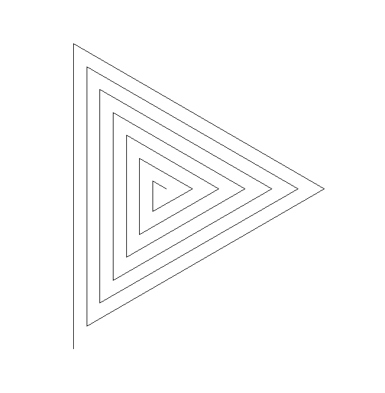
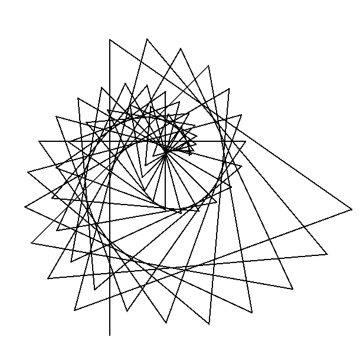
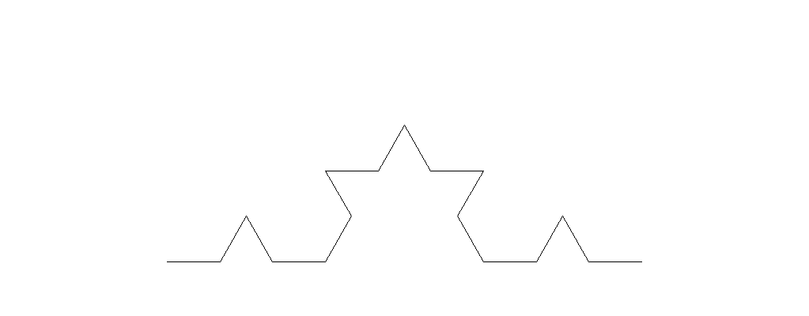
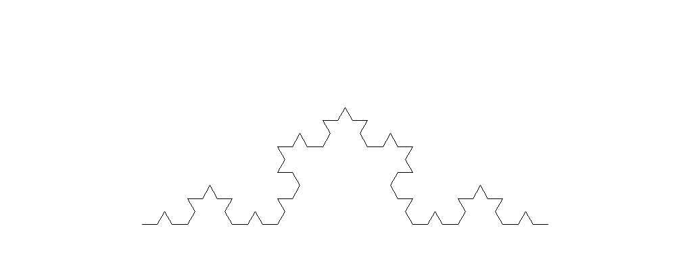
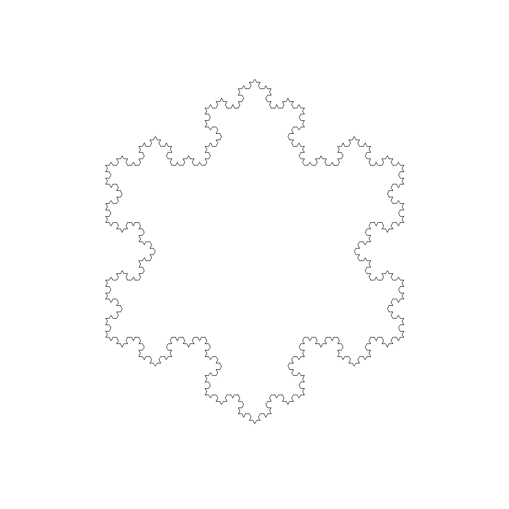
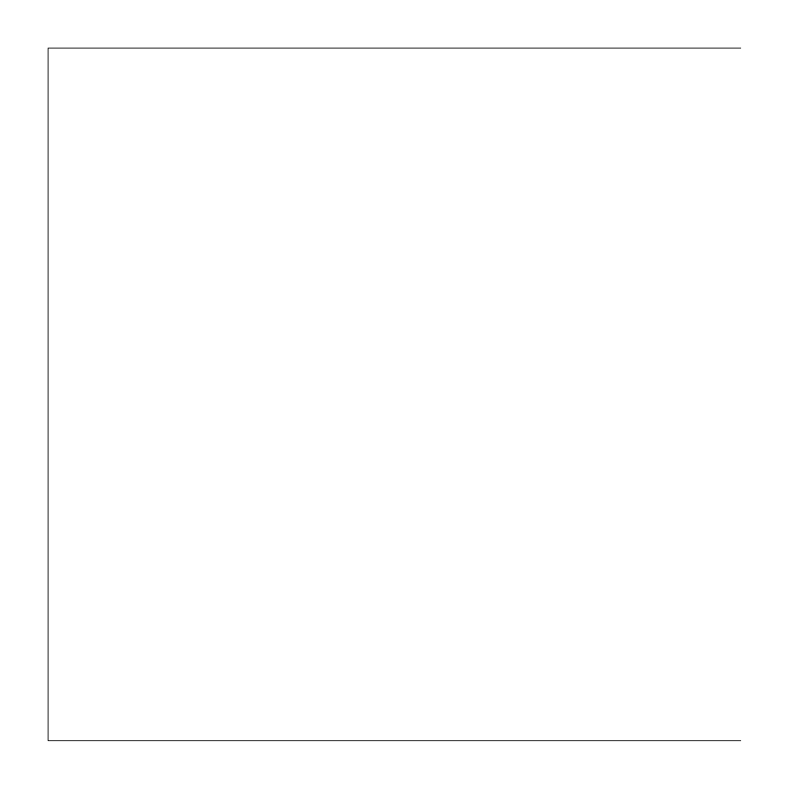
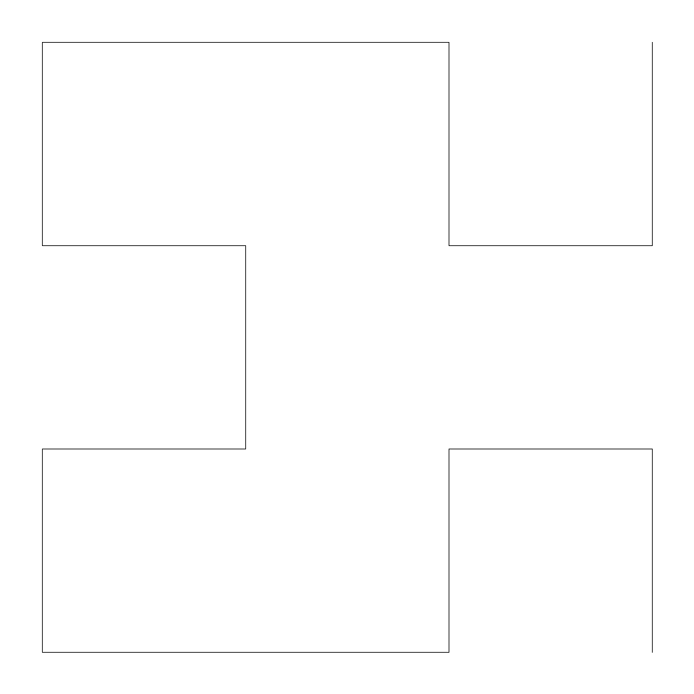
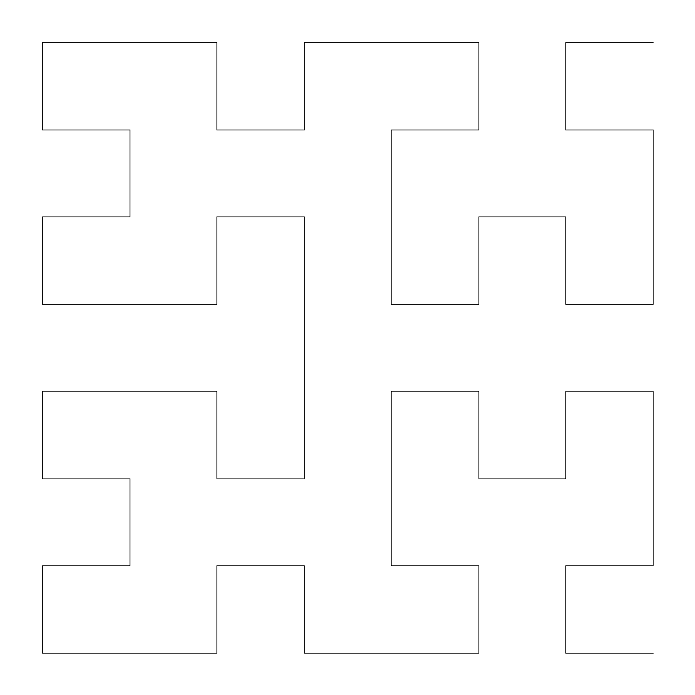
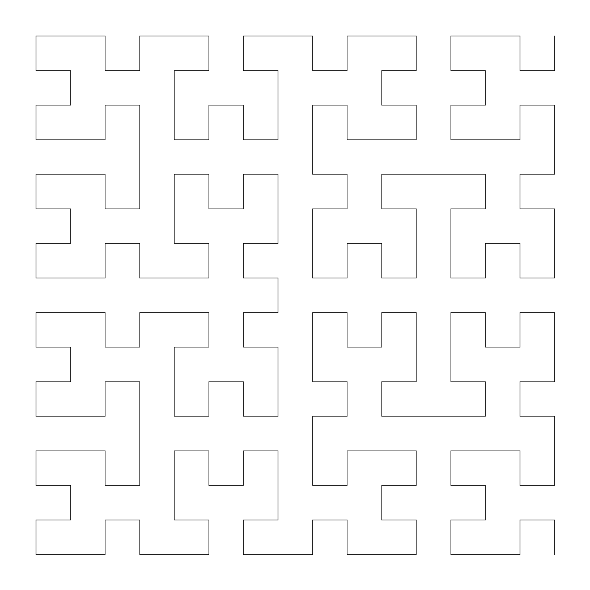
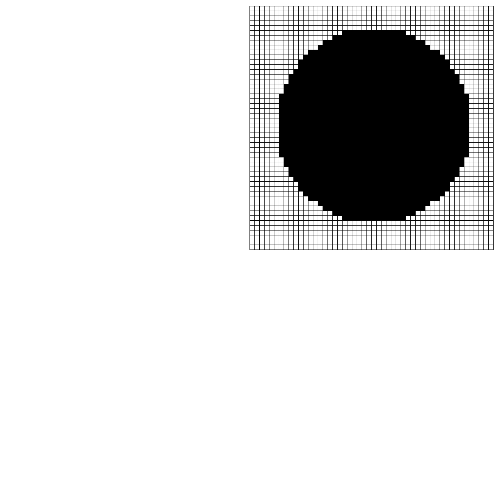


# Übungen 1

## Forum

Zum gegenseitigen Austausch und zur Übungsdiskussion können wir das Forum des Kurses im [GymInf Moodle](https://moodle.unifr.ch/mod/forum/view.php?id=924407) benutzen. 

### Übungs-Hilfsdateien

Bitte verwenden Sie die Vorlage für diese Übung:

1. Laden Sie die Vorlagen als [Zipfile](https://github.com/andreas-forster/gyminf-programmieren/raw/master/docs/uebungen/uebungen1.zip) herunter.
2. Entpacken Sie die Zip-Datei anschliessend.
3. Öffnen Sie den entpackten Ordner in Visual Studio Code.
4. Bearbeiten Sie die Übungen.


## Hinweise

* Es sind bei dieser Übung mehr Aufgaben als Sie wahrscheinlich in sinnvoller Zeit bearbeiten können. Wir haben die Übungen mit einem `*` markiert, welche wir empfehlen bis zum nächsten Kurstag zu lösen. Dies kann durchaus `8-10 Stunden` in Anspruch nehmen. 
* Wir empfehlen Ihnen, dass Sie im Buch "Sprechen Sie Java" bis und mit Kapitel 9 lesen.
* Wechseln Sie in den Ordner `src/main/java`. Dort finden Sie die Dateien, in welche Sie ihren Java Code schreiben.
* Schreiben Sie ihr Programm, kompilieren Sie dieses mit dem Java Compiler `javac` und führen Sie es mit `java` aus, wie es in der Vorlesung gezeigt wurde.
* Wenn Sie denken, dass alles in Ordnung ist, wechseln Sie zurück ins Übungsverzeichnis `uebung1`. Dort können Sie dann eine automatisierte Test-Suite verwenden um Ihre Lösung bis zu einem gewissen grad selbständig zu überprüfen. Falls Sie das automatisierte Testen verwenden möchten, lesen Sie bitte die [Kurzanleitung](kurzanleitung-gradle.md)

## Aufgaben Übersicht
1. [*Quersumme bilden](#quersummen)
1. [*Iterationsverfahren nach Newton](#iterationsverfahren)
1. [*Zeichenketten-Analyse](#zeichenketten-analyse)
1. [Zahlenbasen](#zahlenbasen)
1. [Kommentarbereinigung](#kommentarbereinigung)
1. [*Bubble-Sort](#bubble-sort)
1. [*Java Stil](#java-stil)
1. [*Turtle Muster zeichnen](#turtle-muster)
1. [*Kochkurve](#kochkurve)
1. [Hilbertwalk](#hilbertwalk)
1. [Pixelgrafik](#pixelgrafik)
1. [Transponierte Matrix](#transponierte-matrix)


## Quersummen
Schreiben Sie ein Programm, welches eine Zahl einliest und deren Quersumme ausgibt.

Bei negativen Zahlen soll die Quersumme negativ sein.

Schreiben Sie Ihre Lösung in die bereits vorbereitete Datei _CrossSum.java_, die Sie im Verzeichnis _uebung2/src/main/java_ finden.

Das Programm sollte sich wie folgt verhalten: 

Wenn der Benutzer die Zeile

```
java CrossSum 17
```

auf der Konsole eingibt, soll das Programm die Zeile
```
8
```
ausgeben.

_Hinweise: Um Parameter welche Java übergeben werden Variablen vom Typ Integer zuzuweisen können Sie folgenden Code benützen:_
```java
int a = Integer.parseInt(args[0]);
```

Für die Lösung brauchen Sie die Ganzzahldivision '/' (nur bei Berechnungen mit Integer-Zahlen) sowie die modulo Operation '%'.

## Iterationsverfahren
Die Kubikwurzel einer positiven reellen Zahl $a$ lässt sich nach Newton näherungsweise durch die Iterationsformel bestimmen:

> $x_{n+1} = \frac{1}{3}(2 x_n + \frac{a}{x_n^2})$

Diese Formel wird wie folgt angewandt. Man wählt einen beliebigen Startwert $x_1$, und
berechnet mit der Formel den Wert $x_2$, indem $x_n = x_1$ und $x_{n+1} = x_2$ gewählt werden.

Das Ergebnis wird dann immer wieder (iterativ) in die Formel hineingesteckt. Die Formel ist so konstruiert, dass die Lösung immer dichter an der Kubikwurzel von $a$ liegt, als der Eingabewert.

Schreiben Sie ein Java-Programm _CubicRoot_, das die Kubikwurzel der Eingabe berechnet. Dabei gilt ein Iterationswert als gut genug, falls er von dem nachfolgendem Iterationswert nicht um mehr als $1e−8$ abweicht. 

Hinweise:
* Deklarieren Sie die Variablen als Typ _double_.
* Weisen Sie zur Verarbeitung der Eingabe $a$ den Wert 
```
Double.parseDouble(args[0])
``` 
zu.
* Starten Sie mit dem Iterationswert 1.
* Nutzen Sie zur Berechnung des Absolutbetrags einer Zahl _x_ die Funktion _Math.abs(x)_.

Schreiben Sie Ihre Lösung in die bereits vorbereitete Datei _CubicRoot.java_, die Sie
im Verzeichnis _uebung2/src/main/java_ finden.

Anmerkung für Interessierte: Die obige Formel ergibt sich aus dem Iterationsverfahren
nach Newton. Um die Nullstelle einer Funktion $f$ zu finden, nutzt man die allgemeine Iterationsvorschrift:

$$x_{n+1} = x_n - \frac{f(x_n)}{f'(x_n)}$$

In unserem Fall ist $f(x) = x^3 - a $.

## Zeichenketten-Analyse
Sie finden im Verzeichnis _src/main/java_ die Datei _Palindrom.java_.
Implementieren Sie die Methode testPalindrom, welche den übergebenen Text daraufhin überprüft, ob er ein Palindrom ist.
Ein Palindrom ist ein Text, dessen Zeichen vorwärts und rückwärts gelesen die selbe Reihenfolge ergeben. **Beachten Sie dabei nur die Buchstaben, nicht die Leer- und Sonderzeichen** des eingegebenen Textes, und ignorieren Sie Gross- und Kleinschreibung. Ein
paar Beispiele für Palindrome sind:

* Reliefpfeiler
* Lagerregal
* egale Lage
* Trug Tim eine so helle Hose nie mit Gurt?
* Eine güldne, gute Tugend: Lüge nie!
* A nut for a jar of tuna.
* Borrow or rob?

## Zahlenbasen
In dieser Aufgabe sollen Sie Zahlen von einer Basis in eine andere umschreiben. Dafür
müssen Sie die fehlenden Methoden in der Java Datei _NumberConversions.java_ implementieren, welche Sie im Verzeichnis _src/main/java_ finden.

### a) Umwandlung einer Dezimalzahl in eine Hexadezimalzahl

Unsere gewohnten Zahlen sind die Dezimalzahlen. Das sind Zahlen zur Basis zehn
mit den Ziffern 0 bis 9. Jede Stelle $i$ hat die Wertigkeit $10^{i−1}$. Die Hexadezimalzahlen sind Zahlen zur Basis 16. Sie bestehen aus den Ziern 0 bis 9 und den Buchstaben A, B, C, D, E und F für die Dezimalwerte 10, 11, 12, 13, 14 und 15. Jede Stelle $i$ hat
die Wertigkeit $16^{i−1}$. Um Hexadezimalzahlen von Dezimalzahlen zu unterscheiden, notieren wir sie mit dem Präfix '0x'.
Beispiel:

0x1B7 $= 1 · 16^2 + 11 · 16^1 + 7 · 16^0 = 256 + 176 + 7 = 439$

Implementieren Sie die Methode binToHex, welche eine positive ganzzahlige Dezimalzahl in eine Hexadezimalzahl umwandelt und diese als String zurückgibt. Verwenden sie keine von Java bereitgestellte Umwandlungsmethode. Ihr Programm sollte sich also wie folgt verhalten:

```
> java NumberConversion 439
0x1B7
```

### b) Umwandlung einer Binärzahl in eine Dezimalzahl
Implementieren Sie die Methode binToDec, welche eine positive ganzzahlige Binärzahl in eine Dezimalzahl umwandelt und diese Zurückgibt. Die Binärzahl wird als String mit dem Präfix 0b
übergeben.
Ihr Programm sollte sich also wie folgt verhalten

```
> java NumberConversion 0b1001
9
```

## Kommentarbereinigung

Sie finden im Verzeichnis _src/main/java_ die Datei _Comments.java_.
Implementieren Sie die fehlende Funktion removeComments, welche für ein übergebenes
Java Programm alle Kommentarzeilen die mit /\* \*/ oder // markiert sind, entfernt.
Das der Methode übergebene Argument darf dabei nicht verändert werden.
Beachten Sie: Verschachtelte Klammerkommentare (also /\* /\* \*/ \*/) sind in Java
Programmen nicht möglich. Ein Klammerkommentar kann aber in einem Zeilenkommentar vorkommen.


## Bubble-Sort

Mit dem Verfahren _Austauschsortieren_ (Bubble Sort) kann man die Elemente eines Arrays
sortieren. Dazu wandert man von vorne nach hinten durch das Array und betrachtet
jeweils benachbarte Elemente. Wenn diese in der falschen Reihenfolge stehen, vertauscht
man sie. Ist man am Ende des Arrays angelangt, beginnt man wieder von vorne - solange
bis keine Vertauschungen mehr auftreten.

Sie finden im Verzeichnis _src/main/java_ die Datei _BubbleSort.java_. Implementieren Sie die fehlenden Methoden in dieser Klasse.

## Java-Stil
Sie finden im Verzeichnis _src/main/java_ die Klasse _styleMess_.

Passen Sie die Klasse so an, dass wenn Sie _gradlew checkstyleStyleMess_ aufrufen,
keine Fehler mehr ausgegeben werden. Sie müssen dafür die Namen von Klassen, Methoden
und Variablen ändern, die Formatierung anpassen, Klammern einfügen, etc. Sie dürfen
keinen Code löschen (d.h. alle Konstrukte müssen im Code noch zu finden sein).

Hinweis 1: Checkstyle erzeugt einen Bericht im HTML Format, welcher einfacher zu lesen
ist. Sie finden die URL in der Ausgabe von Checkstyle.

Hinweis 2: Die Java Code-Konventionen sind auf der Seite von Oracle dokumentiert:
<https://www.oracle.com/technetwork/java/codeconvtoc-136057.html>

## Turtle-Muster

Versuchen Sie folgende zwei Muster mit Turtlegrafik zu reproduzieren: Es ist dabei nicht wichtig, dass Sie genau dieselben Linienabstände oder Winkel wählen. Wichtig ist der allgemeine Aufbau des Musters.

{:height="50%" width="50%"}{:height="50%" width="50%"}

Das Programm sollte sich wie folgt verhalten: Wenn der Benutzer das Programm mit den
Argumenten _1 output.png_ aufruft, soll das Programm das erste Muster in die Datei
_output.png_ schreiben. Entsprechend sollen der Aufruf mit den Argumenten _2 output.png_ das zweite Muster produzieren.

Schreiben Sie Ihre Lösung in die bereits vorbereitete Datei TurtlePatterns.java,
die Sie im Verzeichnis _uebung2/src/main/java_ finden.
Dieses Programm nutzt wieder die Java Bibliothek (jturtle), die Sie beim kompilieren
explizit mitangeben müssen. Sie kompilieren die Datei analog zur Squares Aufgabe auf 
[Übungsblatt 1 ](../block1/uebungen1.md)

## Kochkurve
Im Verzeichnis _src/main/java_ finden Sie die Klasse Snowflake.png Implementieren Sie eine Methode _drawKochCurve_. Diese Methode soll rekursiv (d.h. durch Aufrufe von sich selbst) folgende Kurven erzeugen:

Rekursionstiefe 1:
{:height="50%" width="50%"}

Rekursionstiefe 2:
{:height="50%" width="50%"}

Rekursionstiefe 3:
{:height="50%" width="50%"}

Die Rekursionstiefe wird durch das Konstruktorargument _depth_ bestimmt.
Die Distanz zwischen Start und Endpunkt der Kurve soll unabhängig von der Rekursionstiefe immer gleich sein und der Konstante _LENGTH_OF_CURVE_ entsprechen.
Nutzen Sie die Methode _setStartPosition_ um das Turtle **vor dem Aufruf der
rekursiven Methode** auf der Zeichenfläche zu positionieren.

Zum Kompilieren und Ausführen müssen Sie, wie öfters, die Turtle Bibliothek mit einbinden. Genauso wie bei Blatt 2: Aufgabe 5 - Rekursion.

Implementieren Sie dann die Methode _drawSnowflake_, welche durch mehrmaliges
Aufrufen von drawKochCurve eine Schneeflocke zeichnet.



## Hilbertwalk
Sie finden im Verzeichnis _src/main/java_ die Klasse _Hilbertwalk_. Implementieren
Sie die Methode _drawHilbert_, welche die Hilbertkurve zeichnet. Die Hilbertkurve ist
eine rekursiv definierte Kurve, die auf den ersten vier Rekursionstiefen wie folgt aussieht:

Rekursionstiefe 1:
{:height="33%" width="33%"}

Rekursionstiefe 2:
{:height="33%" width="33%"}

Rekursionstiefe 3:
{:height="33%" width="33%"}

Rekursionstiefe 4:
{:height="33%" width="33%"}

Um die Kurve zu zeichnen, müssen Sie zwei rekursive Methoden, _hilbertA_ und _hilbertB_ definieren, welche sich gegenseitig aufrufen. Die Regeln sind wie folgt. Sie starten mit einer Methode _hilbertA_, welche mittels Turtle folgendes Sequenz definiert:

Methode A : $− BF + AF A + F B −$

Das $+$ respetive $−$ bedeutet, dass sie 90 Grad nach rechts, respektive links drehen. Ein $F$
bedeutet, dass Sie das Turtle nach vorne bewegen müssen. Ein $B$ bedeutet, dass Sie die
Methode _hilbertB_ aufrufen. Die Methode _hilbertB_ wird nach dem ähnlichen Muster
definiert:

Methode B: $+ AF − BF B − F A+$

Ein $A$ bedeutet hier, dass Sie wiederum die Methode _hilbertA_ aufrufen müssen.

Beginnen Sie die Aufgabe, indem Sie jede Linie mit der fixen Länge zeichnen, die in dem Feld lengthLineSegment definiert ist. Die Zeichnung wird dadurch auf jeder Rekursionsebene grösser. Passen Sie in einem zweiten Schritt die Methode
_computeLengthOfLineSegment_ an, so dass die Seitenlänge jeder Zeichnung der Konstanten _BASE_LENGTH_ entspricht.
Tipp: Sie brauchen dafür die Methode _Math.pow(a, b)_ welche $a^b$
berechnet.

Wiederrum müssen Sie das jturtle-jar Archiv einbinden beim Kompilieren und Ausführen. Genauso wie bei Blatt 2: Aufgabe 5 - Rekursion.


## Pixelgrafik

Sie finden im Verzeichnis _src/main/java/_ die Datei _TurtlePixelGraphics.java_.
Darin sind die Methoden drawPixel und newLine implementiert, mit der Sie mit
Turtlegrafik einen Pixel an der aktuellen Turtleposition zeichnen können sowie jeweils auf
die nächste Zeile springen können.

Implementieren Sie eine Methode _drawImage(bool[][] image)_, welches ein 2D boolean Array nimmt, und daraus das resultierende Bild zeichnet, indem es obige Funktionen
aufruft.

Um die Methoden zu testen, implementieren Sie eine Methode _implicitCircle_ welche
die impliziten Gleichung für den Kreis

$x^2+y^2-r^2<0$

einen Kreis mit Radius _r_ implementiert.

Schlussendlich implementieren Sie die Methode _drawCircleImage_, welche ein Bild (ein
2D boolean Array) eines Kreises mit gegebenem Radius erstellt.

> Hinweis: Beachten Sie, dass obige Kreisgleichung einen Kreis mit Radius $r$ mit Mittelpunkt
$(0, 0)$ definiert. Sie können also nicht direkt die Indizes ihres Arrays für die Definition
nehmen, sondern müssen diese noch entsprechend anpassen, damit der Kreis in die Mitte
des Bildes zu liegen kommt.

Kompilieren und starten Sie das Programm mit der Angabe der Datei jturtle-0.5.jar, also so wie die Squares Aufgabe auf Blatt 1.

Es sollte folgendes Bild erstellt werden:



## Transponierte Matrix

Sie finden im Verzeichnis src/main/java/ die Datei Matrix.java. Implementieren
Sie die Methode transpose(double[][] matrix) die eine Matrix von beliebiger
Dimension nimmt und die Transponierte dieser Matrix zurückgibt. Die übergebene Matrix
darf dabei nicht verändert werden.
