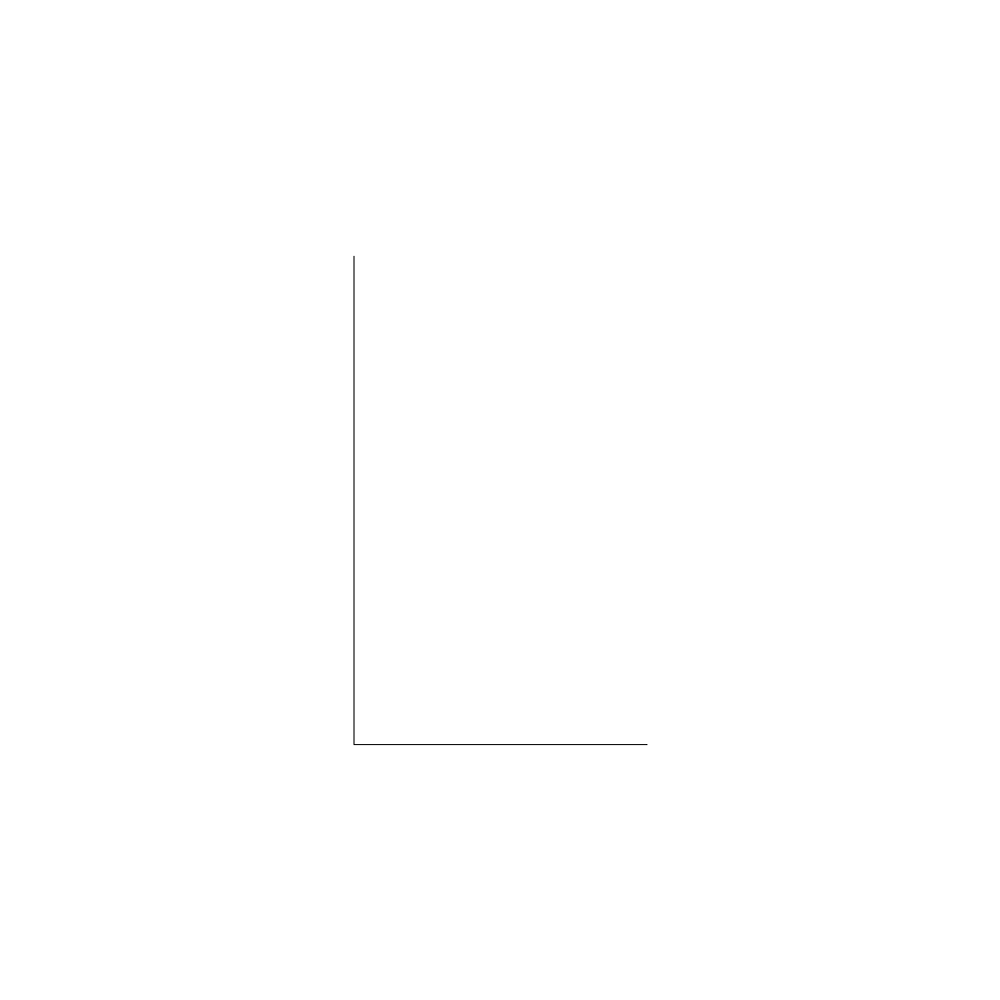
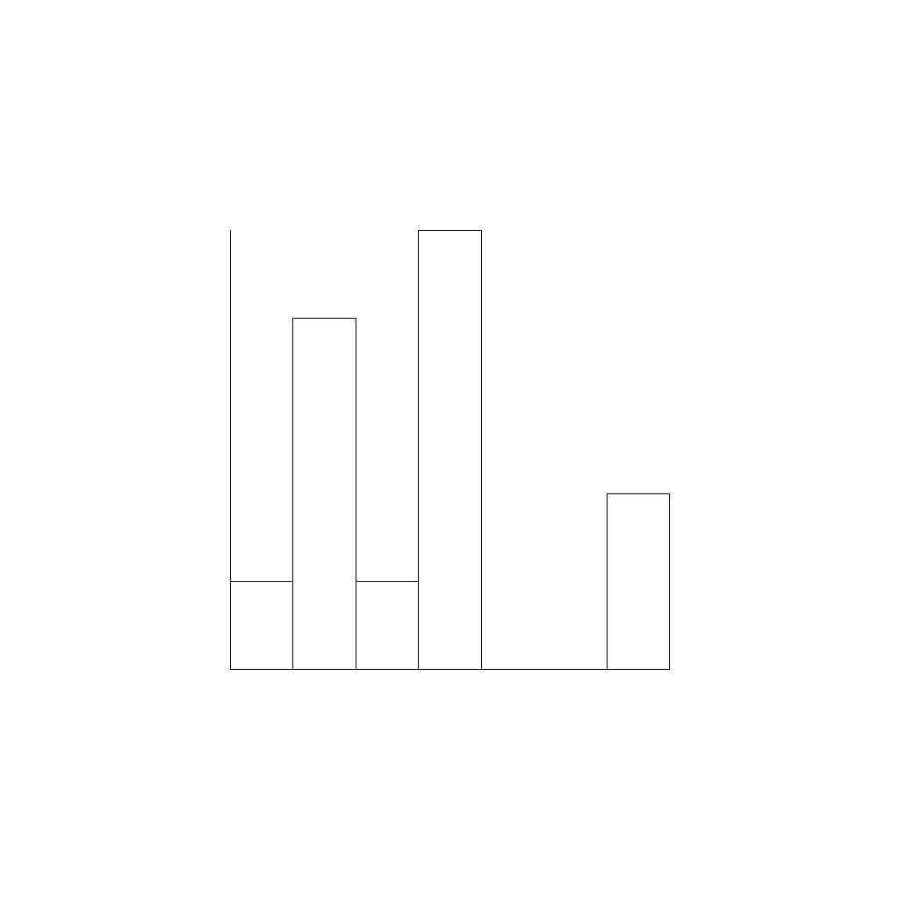
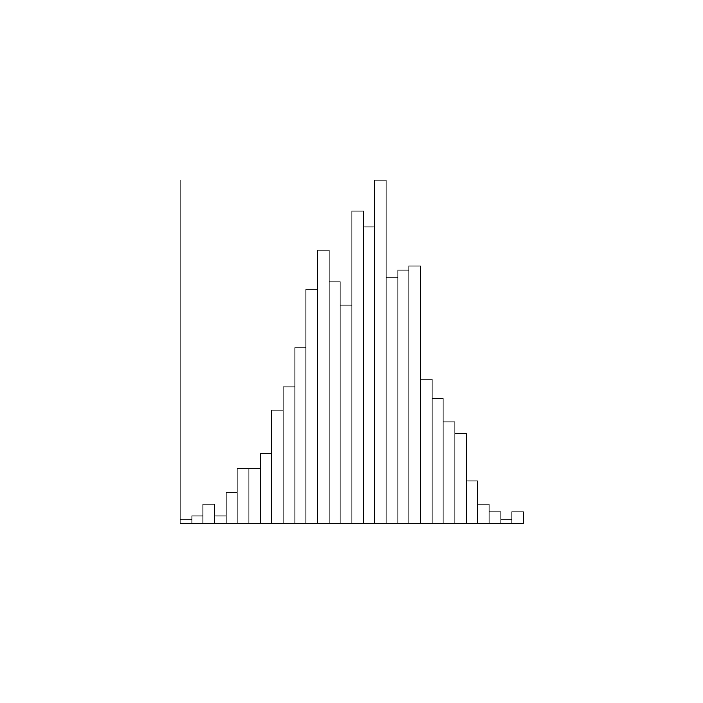
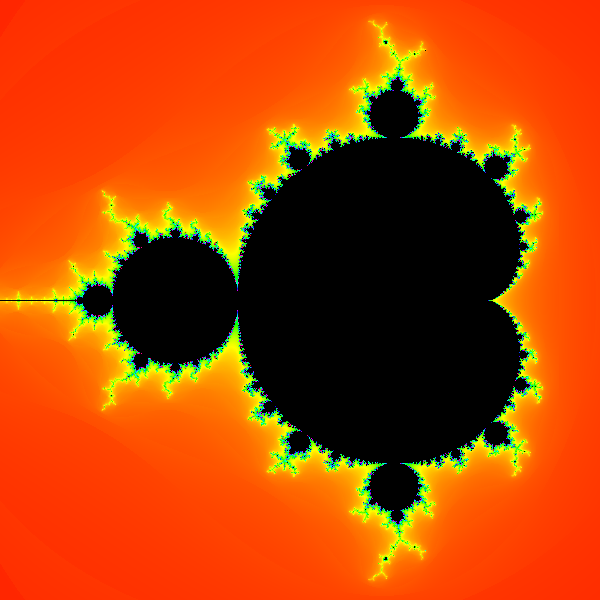


# Übungen 2

## Forum

Zum gegenseitigen Austausch und zur Übungsdiskussion können wir das Forum des Kurses im [GymInf Moodle](https://moodle.unifr.ch/mod/forum/view.php?id=924407) benutzen. Ziel ist es, einen Thread / ein Thema pro Aufgabe zu haben und dort drin alle Fragen und Antworten zur Aufgabe zu sammeln. Sie können gerne auch bei Fragen zur Software, Installation oder dem Umgang mit VS Code neue Threads im Forum starten.

### Übungs-Hilfsdateien

Bitte verwenden Sie die Vorlagen für diese Übung:

1. Laden Sie die Vorlagen als [Zipfile](https://github.com/andreas-forster/gyminf-programmieren/raw/master/docs/uebungen/uebungen2.zip) herunter.
2. Entpacken Sie die Zip-Datei anschliessend.
3. Öffnen Sie den entpackten Ordner `uebungen2` in Visual Studio Code.
4. Bearbeiten Sie die Übungen.

### Allgemeine Hinweise

* Es sind bei dieser Übung mehr Aufgaben als Sie wahrscheinlich in sinnvoller Zeit bearbeiten können. Wir haben die Übungen mit einem `*` markiert, welche wir empfehlen bis zum nächsten Kurstag zu lösen. Dies kann durchaus `8-10 Stunden` in Anspruch nehmen.
* Wir empfehlen Ihnen, dass Sie im Buch ***Sprechen Sie Java*** bis und mit ***Kapitel 11*** lesen.
* Wechseln Sie in den Ordner `src/main/java`. Dort finden Sie die Dateien, in welche Sie ihren Java Code schreiben.
* Schreiben Sie ihr Programm, kompilieren Sie dieses mit dem Java Compiler `javac` und führen Sie es mit `java` aus, wie es in der Vorlesung gezeigt wurde.
* Wenn Sie denken, dass alles in Ordnung ist, wechseln Sie zurück ins Übungsverzeichnis `uebungen2`. Dort können Sie dann eine automatisierte Test-Suite verwenden um Ihre Lösung bis zu einem gewissen grad selbständig zu überprüfen. Falls Sie das automatisierte Testen verwenden möchten, lesen Sie bitte die [Kurzanleitung](kurzanleitung-gradle.md)
> :warning: In dieser Aufgabe werden nicht alle Aufgaben durch automatisierte Tests überpüft. Zum Testen der Aufgaben, die Grafiken produzieren, schauen Sie ob die Grafiken den Vorgaben entsprechen.

## Inhalt
 
In dieser Aufgabe entwickeln wir unsere eigenen grösseren Programme, zum einen um Histogrammplots zu erstellen und zum anderen um Fraktale zu berechnen und zu zeichnen. Dabei lernen Sie, wie Sie mit Klassen und Objekten arbeiten und wie Sie komplexe Funktionalität aus einfachen Teilen zusammensetzen können.

1. **Histogram**
    1. [*Der Punkt](#der-punkt)
    1. [*Grafische Elemente](#grafische-elemente)
    1. [*Histogram](#histogram)
    1. [*Plotten Des Histogramms](#plotten-des-histograms)
    1. [Farbige Grafiken](#farbige-grafiken)

1. **Mandelbrot (Fraktal)**

    1. [*Komplexe Zahlen](#komplexe-zahlen)
    1. [Mandelbrotmenge](#mandelbrotmenge)
    1. [Visualisierung der Mandelbrotmenge](#visualisierung-der-mandelbrotmenge)
    1. [*Color Klasse](#color-klasse)
    1. [Bonus zur Mandelbrotvisualisierung](#bonus-zur-mandelbrotvisualisierung)


## Der Punkt

Im Verzeichnis `src/main/java/` finden Sie die Klasse `Point`, welche einen Punkt im
Raum durch die Raumkoordinaten (x, y) repräsentiert. Implementiere Sie die fehlenden
Teile dieser Klasse.

>:point_up: Schreiben Sie eigene kleine Testprogramme in der `main` Methode, um Ihre Implementation zu testen. Wenn alles funktioniert, nutzten Sie auch die mitgelieferten Tests. Mit `gradlew test --tests PointTests` können Sie nur die Tests für diese Klasse
ausführen.

## Grafische Elemente

Im Verzeichnis `src/main/java` finden Sie die Klassen `Rectangle` und `PlotAxes`.
Diese sollen es erlauben, durch das Angeben eines Referenzpunktes sowie der Länge und
Höhe jeweils ein Rechteck respektive die Achsen eines Koordinatensystems zu zeichnen
(siehe Bild unten).

Implementieren Sie die fehlenden Methoden und testen Sie ihr Programm. Nutzen Sie dazu
die statische Methode `TurtleUtils.SetTurtlePosition` um die  Methode `SetTurtlePosition` aufzurufen, welche in der Klasse `TurtleUtils` implementiert ist.

> :warning: Beim Kompilieren der Programme müssen Sie die Turtle Bibliothek wieder einbinden, wie bei den vorherigen Aufgaben wo mit der Turtle gearbeitet wurde.

Koordinatenachse

{:width="50%"}

Rechteck

{:width="50%"}


## Histogram

Im Verzeichnis `src/main/java/` finden Sie die Klasse `Histogram`.
Der Zweck dieser Klasse ist es, ein Array von Werten entgegenzunehmen und zu zählen, wie viele der Werte in Klassen (genannt Bins) fallen.
Die Klassen werden durch Intervalle fester Länge definiert.

Implementieren Sie die fehlenden Methoden.
Beginnen Sie dabei mit den Methoden `getMinValue` und `getMaxValue`, da Sie diese in den anderen Methoden brauchen werden.
Die Kommentare im Code beschreiben genauer was die jeweiligen Methoden machen.

>:point_up: Schreiben Sie eigene kleine Testprogramme in der Main-methode um Ihre Implementation zu testen.
Wenn alles funktioniert nutzen Sie auch die mitgelieferten Tests.


## Plotten des Histograms

Schlussendlich implementieren Sie die fehlenden Methoden in der Klasse `HistogramPlot`.
Diese Klasse soll die Klassen `Histogram`, `Rectangle` und `PlotAxes` nutzen, um für
ein gegebenes Array von Zahlen das Histogram zu plotten. Testen Sie ihr Programm. Der
in der Main-Methode mitgegebene Testcode sollte Plots generieren, die ungefähr wie diese
im Bild aussehen.

Einfacher Testfall



Komplexter Testfall




## Farbige Grafiken

Können Sie das Programm so anpassen, dass die Balken der
Histogramme farbig gezeichnet werden? Nutzen Sie dazu die Methode `fill` von Turtle.

## Komplexe Zahlen

Eine komplexe Zahl ist eine Zahl $a + bi$.
Sie müssen die komplexe Zahlen nicht vollständig verstehen um die Aufgabe zu lösen.
Sie können sich die Zahl wie ein Punkt mit Koordinaten $a$ und $b$ vorstellen.
Das $i$ bezeichnet den *imaginären* Teil $b$ der Zahl.
Für das Rechnen mit komplexen Zahlen gelten folgenden Rechenregeln:

Addition: $(a + bi) + (c + di) = (a + c) + (b + d)i$

Multiplikation: $(a + bi)(c + di) = (ac + bd) + (ad + bc)i$

Betrag: $\vert(a + bi)\vert = \sqrt{a^2 + b^2}$

Im Verzeichnis `src/main/java` finden Sie die Klasse `Complex`. Implementieren Sie die
fehlenden Methoden.

Beachten Sie, dass Sie die Operationen Addition und Multiplikation jeweils in zwei Varianten implementieren müssen.
In der einen Variante soll der berechnete Wert als neues Objekt zurückgegeben werden.
In der zweiten Variante wird das aktuelle Objekt verändert.
Testen Sie Ihre Klasse mit den mitgelieferten Tests.

## Mandelbrotmenge

In dieser Aufgabe schreiben Sie ein Programm, dass die Mandelbrotmenge (siehe Bild weiter unten) berechnet. (Sie müssen die folgende Erklärung nicht verstehen, Sie können auch zur eigentlichen Aufgabe im letzten Abschnitt springen.)

Die Mandelbrotmenge ist definiert, als die Teilmenge der komplexen Zahlen $c$, für die die Folge $z_0=0, z_{n+1} = z_{n}^2 + c$ beschränkt ist.
Das heisst die Mandelbrotmenge besteht aus den Zahlen, für die es eine Konstante $k$ gibt, so dass alle Elemente der Folge $z_n(c)$ kleiner $k$ sind.

$
  \\{ c \in \mathbb{C} \mid \exists k \in \mathbb{R},\; \forall n \in \mathbb{N}: |z_n| < k \text{ mit } z_0=0, z_{n+1}=z_n^2+c\\}
$

Man kann diese Menge darstellen, indem man die zu ihr gehörenden Punkte der
komplexen Zahlenebene einfärbt. Um die obige Definition für eine gegebene
Zahl $c$ zu testen, müsste man **alle** Elemente der Folge $z_n$
betrachten, was in der Praxis natürlich nicht möglich ist. Darum stellen
wir stattdessen die "Fluchtgeschwindigkeit" der Folge $z_n(c)$ dar. Die
"Fluchtgeschwindigkeit" definieren wir als das kleinste $n$ von $z_n(c)$, so
dass $|z_n(c)| > 2$. 

Im Verzeichnis `src/main/java` finden Sie die Klasse `Mandelbrot`. Implementieren
Sie die Methode `computeMandelbrot`, welche für eine gegebene Zahl die Mandelbrot Folge $z_0=0, z_{n+1} = z_{n}^2 + c$ berechnet und ein Resultatobjekt zurückgibt, welches die Resultate der Berechnung enthält.
Testen Sie Ihr Programm mit den mitgelieferten Tests.

## Visualisierung der Mandelbrotmenge

In dieser Aufgabe visualisieren Sie die Mandelbrotmenge.
Dafür implementieren Sie die Methode `createMandelbrotVisualization`.
Dafür laufen Sie über die Pixel eines Bildes, und ordnen jedem Pixel eine komplexe Zahl mit der Methode `pixelPosToComplexNumber`.
Berechnen Sie dann die Mandelbrotfolge mit der in der vorigen Aufgabe implementierten Methode und nutzen Sie die Hilfsklasse `ColorPalette` um eine Farbe entsprechend der Berechnung auszuwählen.
Wenn Sie das Programm kompilieren und mit den in der Main-Methode angegebenen Parametern ausführen, sollten Sie etwa folgendes Bild erhalten:



## Color Klasse

Implementieren Sie die Methode `ColorPalette.colorToGreyscale`. Diese soll eine Farbe, wie die von `ColorPalette.getColor` zurückgegeben wird, in Graustufen
umwandeln. Dies schaffen Sie, indem die R G B Komponente der Farbe jeweils durch das
gewichtete Mittel $R * 0.2989 + G * 0.5870 + B * 0.1140$ ersetzen.

Lesen Sie die Dokumentation der Klasse Color um die richtigen Methoden der Klasse Color zu finden: <https://docs.oracle.com/en/java/javase/11/docs/api/java.desktop/java/awt/Color.html>.

Testen Sie Ihre Implementation mit den mitgelieferten Tests.

## Bonus zur Mandelbrotvisualisierung

* Visualisieren Sie nun die Mandelbrotmenge auch als Graustufenbild mit Hilfe der letzten Aufgabe.

* Wenn Sie die Mandelbrotvisualisierung gelösst haben, können Sie eine ganz einfache Animation hinbekommen. Fügen Sie dazu den folgenden Code in der `main`-Methode der Visualisierung ein, rufen Sie die `main`-Methode auf und lassen Sie sich in VS Code das Bild anzeigen. Das Bild sollte dann automatisch neu geladen werden.

```java
for ( double d = 0.004; d > 1e-10; d *= 0.9){
    mb.createMandelbrotVisualization(
        d,
        -0.604894,
        -0.614894,
        100
    );
    mb.save("mandelbrot.png");
    try {
        Thread.sleep(100);
    } catch (Exception e) {
        System.out.println(e.getMessage());
    }
}
```
