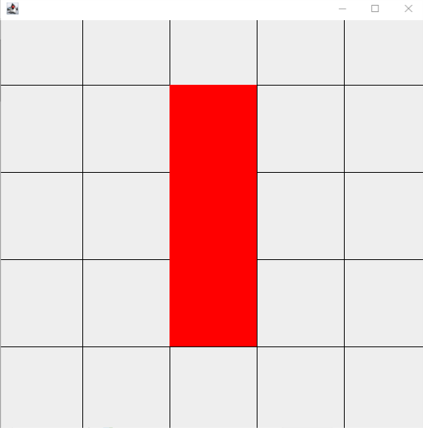
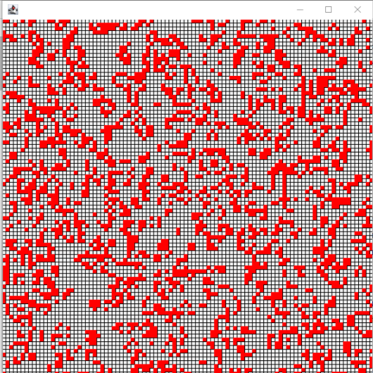


# Übungen 3

## Forum

Zum gegenseitigen Austausch und zur Übungsdiskussion können wir das Forum des Kurses im [GymInf Moodle](https://moodle.unifr.ch/mod/forum/view.php?id=924407) benutzen. Ziel ist es, einen Thread / ein Thema pro Aufgabe zu haben und dort drin alle Fragen und Antworten zur Aufgabe zu sammeln. Sie können gerne auch bei Fragen zur Software, Installation oder dem Umgang mit VS Code neue Threads im Forum starten.

### Übungs-Hilfsdateien

Bitte verwenden Sie die Vorlagen für diese Übung:

1. Laden Sie die Vorlagen als [Zipfile](https://github.com/andreas-forster/gyminf-programmieren/raw/master/docs/uebungen/uebungen3.zip) herunter.
2. Entpacken Sie die Zip-Datei anschliessend.
3. Öffnen Sie den entpackten Ordner `uebungen3` in Visual Studio Code.
4. Bearbeiten Sie die Übungen.

### Allgemeine Hinweise

* Es sind bei dieser Übung mehr Aufgaben als Sie wahrscheinlich in sinnvoller Zeit bearbeiten können. Wir haben die Übungen mit einem `*` markiert, welche wir empfehlen bis zum nächsten Kurstag zu lösen. Dies kann durchaus `8-10 Stunden` in Anspruch nehmen.
* Wir empfehlen Ihnen, dass Sie im Buch ***Sprechen Sie Java*** bis und mit ***Kapitel 13*** (ohne 12) lesen.
* Wechseln Sie in den Ordner `src/main/java`. Dort finden Sie die Dateien, in welche Sie ihren Java Code schreiben.
* Schreiben Sie ihr Programm, kompilieren Sie dieses mit dem Java Compiler `javac` und führen Sie es mit `java` aus, wie es in der Vorlesung gezeigt wurde.
> :warning: In dieser Aufgabe werden die Aufgaben nicht durch automatisierte Tests überpüft. Schauen Sie ob die Ausgabe den Vorgaben entspricht um die Aufgaben zu testen oder versuchen Sie in kleinen Schritten mit Hilfe von Ausgaben Ihren Code zu überprüfen.

## Inhalt
 1. [*Felder](#felder)
 1. [*Konstruktoren](#konstruktoren)
 1. [*Evolution](#evolution)
 1. [*Ausgabe](#ausgabe)
 1. [*Testprogramm](#testprogramm)
 1. [*Regeländerung (Vererbung)](#regeländerung)
 1. [Für Unerschrockene](#für-interessierte)


## Game Of Life
Das Spiel des Lebens (Game of Life) geht auf den Mathematiker John Conway zurück.

Die Grundeinheit sind Zellen, die in einer Matrix angeordnet sind.
Jede Zelle kann lebendig oder tot sein.
Jede Zelle hat acht Nachbarn, wobei Randzellen die Zellen des gegenüberliegenden Randes als Nachbarn haben.
Der Zustand der Zellen (lebendig oder tot) ändert sich von Generation zu Generation.
Die aktuelle Zellpopulation beeinflusst die darauffolgende Generation nach folgenden Regeln:

1. Eine nicht lebende Zelle mit genau drei lebenden Nachbarn erwacht zum Leben (*birth*).
1. Alle anderen nicht lebende Zellen bleiben im Status nicht lebend.
1. Eine lebende Zelle mit zwei oder drei lebenden Nachbarn bleibt am Leben (*survival*).
1. Alle anderen lebenden Zellen sterben (*overcrowding* or *loneliness*).

Sie finden im Verzeichnis `src/main/java/` die Klasse `GameOfLife`. Folgend Sie den Anweisungen um die Klasse zu verfollständigen. Schreiben Sie dabei immer wider Test-Code in der main-Methode um die von Ihnen implementierten Funktionen zu prüfen.

Wenn Sie sich für das Game of Life interessieren, oder eine Demo sehen wollen, schauen Sie sich z.B. [diese](https://beltoforion.de/de/game_of_life/) Webseite an.

### Felder
Definieren Sie die nötigen Felder der Klasse. Die Zellenpopulation soll als eine `size`x`size` Matrix (2d-Array) vom Typ `boolean` gespeichert werden. Speichern Sie auch die Grösse `size` als Feld der Klasse.

### Konstruktoren

Implementieren Sie den Konstruktor, welcher ein boolean Array mit einem gegebenen Muster (repräsentiert als boolean 2d-Array) entgegennimmt und die entsprechenden Felder der Klasse richtig setzt.

Um verschiedene Felder anzulegen, implementieren Sie verschiedene statische Methoden. Es reicht zu beginn, wenn Sie eine implementieren. Die Methoden
`createBlock`, `createBlinker` und `createGlider`
 erstellen eine neue Zellenpopulation als 2d-boolean Array mit folgenden Mustern (`'.'` steht für `false`, `'@'` steht für `true`):

#### Block
    ....
    .@@.
    .@@.
    ....

#### Blinker
    .....
    ..@..
    ..@..
    ..@..
    .....

#### Glider
    ......
    .@.@..
    ..@@..
    ..@...
    ......
    ......

#### Random
Implementieren Sie ausserdem eine statische Methode `createRandom` mit zwei Parameter.
Der erste Parameter ist die Feldgrösse, dabei soll das Feld quadratisch sein. Der zweite Parameter ist die Wahrscheinlichkeit `probability` (eine Zahl zwischen 0.0 und 1.0), dass eine Zelle als lebend (`true`) initialisiert wird. Der Wert jeder Zelle soll also zufällig gesetzt werden.
Sie erreichen dies durch die Verwendung der Klasse `java.util.Random` wie in den folgenden Code-Zeilen skizziert:
```java
// nötiger import zuoberst in der Datei
import java.util.Random;

// Zufallszahlen generator erstellen
Random geneartor = new Random();

// nextDouble() gibt eine zufällige Zahl zwischen 0.0 und 1.0 zurück
boolean alive = generator.nextDouble() < probability;
```


### Evolution
Implementieren Sie die Methode `isActive`, die den Wert aus dem Feld abfragt und behandeln Sie dabei die Zellen am Rande speziell. Dabei soll der Zugriff auf eine Zelle jeweils auf der gegenüberliegenden Seite geschehen, wenn auf die Nachbarn von Zellen am Rand zugegriffen wird.

Nun implemenetieren Sie die Methode `getNumberOfActiveNeighbors`, welche die lebenden Nachbarn einer Zelle zählt und die `isActive` Methode verwendet.

Als letztes soll die Methode `update`, welche das Update ausführt geschrieben werden. Dabei soll der Zustand aller Zellen
zur "gleichen" Zeit neu berechnet werden. Sie müssen also mit einem zweiten Feld an Zellen arbeiten um den aktuellen Zustand nicht zufrüh zu überschreiben.

### Ausgabe
Schreiben Sie nun noch die Methode `public String toString()`, welche die Population in einem String darstellt.
Um Zeilenumbrüche in einem String darzustellen, können Sie das Zeichen `'\n'` verwenden.
Jede Zelle soll dabei durch `'.'` dargestellt werden wenn sie nicht lebt oder durch ein `'@'` wenn sie lebt.

### Testprogramm

Implementieren Sie die Methoden im Testprogramm `GameOfLifeCommandLine`, welches ein neues `GameOfLife` erstellt und dann die Evolutionsschritte vom `GameOfLife` berechnet sowie das Ergebnis für jeden Schritt auf der Konsole ausgibt.


## Regeländerung

Wir wollen nun anschauen, was passiert wenn wir die Regeln beim `GameOfLive` etwas ändern und gleichzeitig die Vererbung von Klassen etwas zu üben.
Um vieles was schon implementiert ist wider zu verwenden, leiten wir von der Klasse `GameOfLive` ab. Folgen Sie dazu den Schritten:

1. Erstellen Sie im Ordner `src/main/java` eine neue Datei mit Namen `ChangedBorderConditions.java`.
1. Schreiben Sie die Klasse `ChangedBorderConditions` welche von `GameOfLive` erbt.
1. Erstellen Sie einen Konstruktor, welcher ein Feld (2d-boolean Array) übergeben bekommt und dieses dem Konstruktor der Oberklasse weitergibt.
1. Überschreiben Sie die Methode `isActive` in der Klasse `ChangedBorderConditions` und geben Sie für Zugriffe von Nachbarn der Randzellen ausserhalb des Feldes `true` zurück.
1. Passen Sie die Klasse `GameOfLifeCommandLine` so an, dass die neue Klasse `ChangedBorderConditions` verwendet wird. Und testen Sie die neue Klasse.
1. Schreiben Sie nun noch eine statische Methode welche ein Feld einer bestimmten Grösse (ähnlich wie Random) mit nur nicht lebenden Zellen erstellt. Verwenden Sie diese statische Methode in der `GameOfLifeCommandLine` Klasse. Was beoabachten Sie?


## Für Interessierte

### Game of Life - AWT

> :warning:  Falls Sie die vorige Aufgabe nicht lösen konnten, können Sie Klasse `MockGameOfLife`
nutzen, die Sie im Verzeichis `src/main/java/` finden.

In dieser Aufgabe haben wir eine Visualisierung des Game of Life vorbereitet, es fehlen jedoch noch kleine Teile der Implementierung.

Sie finden im Verzeichnis`src/main/java/` die Java-Klasse `GOLWindow` zur Visualisierung des Game Of Life. Implementieren Sie die fehlenden Methoden in dieser Klasse, gemäss den angegebenen Spezifikationen in den Kommentaren.

Experimentieren Sie mit verschiedenen Konfigurationen. Für die Konfiguration Blinker (und das MockGameOfLife) sollte ihre Ausgabe im ersten Schritt etwa so wie das folgende Bild aussehen:



Wenn Sie grosse, zufällige Welten simulieren, sieht die Ausgabe etwa wie
in diesem Bild aus:

