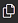
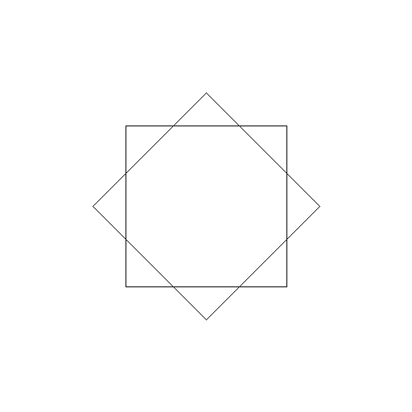


# Übungs Einführung


## Forum

Zum gegenseitigen Austausch und zur Übungsdiskussion können wir das Forum des Kurses im [GymInf Moodle](https://moodle.unifr.ch/mod/forum/view.php?id=924407) benutzen. 

### Übungs-Hilfsdateien

Bitte verwenden Sie die Vorlage für diese Übung:

1. Laden Sie die Vorlagen als [Zipfile](https://github.com/andreas-forster/gyminf-programmieren/raw/master/docs/uebungen/uebungenEinfuehrung.zip) herunter. Sie sollten dann die datei `uebungenEinfuehrung.zip` auf Ihrem Computer sehen.
2. Entpacken Sie die Zip-Datei anschliessend. Sie sollten dann den Übungsordner mit Namen `uebungenEinführung` sehen in dem 3 Ordner (config, gradle, src) und einige Dateien liegen.
3. Öffnen Sie den Ordner `uebungenEinführung` in Visual Studio Code (Menu `Datei` > `Öffnen ...`). Sie sollten dann auf der linken Seite von VSCode den Inhalt des Ordners sehen. Es sollten die Unterordner `config`, `gradle` und `src` sowie weitere Files angezeigt werden. (Es kann sein, dass Sie zuerst noch auf das folgende Symbol klicken müssen: )
4. Im Unterordner `src/main/java` finden Sie dann die `*.java` Dateien die Sie bearbeiten sollen.
5. Um diese zu kompilieren, gehen Sie ins Terminal. Wenn Sie noch kein Terminal haben, öffnen Sie das Terminal (Menu > `Terminal` > `Neues Terminal`). Wechseln Sie in den Unterordner `src/main/java`. Wenn Sie den dafür benötigten Befehl `cd` nicht kennen, gibt es mehr Informationen [hier](../installation/kommandozeile.md).


## Aufgabe 1 - Berechnung des BMI

Schreiben Sie ein Java-Programm, das den BMI berechnet. Nutzen Sie dazu die bereits vorbereitete Datei _BMI.java_, die Sie im Verzeichnis `uebungenEinfuehrung/src/main/java` finden.

Ihr Programm sollte als Parameter die Grösse (in cm) und das Gewicht (in kg) übergeben bekommen. Dabei soll ein Aufruf

```
java BMI 188 88
```

den BMI anhand der Formel

$$\frac{Gewicht[kg]}{Grösse[m]^{2}}$$

berechnen und die folgende Ausgabe auf die Konsole schreiben:

```
Ihr BMI beträgt: 24.898143956541425
Sie haben einen BMI zwischen 20 und 25.
```

Die zweite Zeile soll dabei jeweils angepasst werden wenn der BMI unter 20 oder über 25 ist. Für unter 20 soll "Sie haben einen BMI unter 20." ausgegeben werden und bei einem BMI über 25 soll "Ihr BMI ist über 25." ausgegeben werden.

> :warning: Hinweis: Um Parameter, welche Java übergeben werden Variablen vom Typ double zuzuweisen, können Sie folgenden Code benützen:

```java
double a = Double.parseDouble(args[0]);
double b = Double.parseDouble(args[1]);
```

## Aufgabe 2 - Turtlegrafik: Quadrate

In dieser Aufgabe schreiben Sie ein Programm, welches ein Bild mittels Turtle Grafik erzeugt. Ergänzen Sie dazu den Code in der Datei `src/main/java/Squares.java`.

Das Bild soll zwei im Zentrum positionierte Quadrate mit Seitenlänge 50 zeichnen, wobei das zweite Quadrat um 45 Grad rotiert ist.

Dieses Programm hängt nun von einer externen Java Bibliothek (jturtle) ab, die in einer .jar Datei zur Verfügung steht. Diese müssen Sie beim kompilieren angeben. Sie kompilieren die Datei wie folgt:

* für Windows
```bash
javac -cp ".;jturtle-0.6.jar" Squares.java 
```
* für Linux und MacOS
```bash
javac -cp .:jturtle-0.6.jar Squares.java
```

Entsprechend ist das Kommando zum Aufruf nun
* für Windows
```bash
java -cp ".;jturtle-0.6.jar" Squares
```
* für Linux und MacOS
```bash
java -cp .:jturtle-0.6.jar Squares
```

> Um das Programm aufzurufen, geben Sie als Kommandozeilenargument den Dateinamen für das resultierende Bild an (mit Endung .png) (also z.B. `java -cp .:jturtle-0.6.jar Squares squares.png`).

Überprüfen Sie Ihre Ausgabe. Wenn Sie die Aufgabe noch nicht gelösst haben, dann bekommen Sie ein komplett weisses Bild. Haben Sie die Aufgabe richtig und vollständig gelösst, sieht das Bild wie folgt aus:



> HINWEIS<br>
> Die relevanten "Turtle" Funktionen finden Sie in der [Turtle Referenz](https://nbviewer.jupyter.org/github/Andreas-Forster/gyminf-programmieren/blob/master/notebooks/Turtle-Referenz.ipynb)


## Automatisiertes Testen der Übungen (optional)

Sie können diese Aufgaben wie schon besprochen manuell mit _javac_ und _java_ kompilieren und ausführen. Wir stellen Ihnen aber eine Test-Suite zur Verfügung, mit denen Sie Ihre Lösung bis zu einem gewissen grad selbständig überprüfen können. Falls Sie das automatisiert testen möchten, lesen Sie bitte die [Kurzanleitung](kurzanleitung-gradle.md)

> HINWEIS (Aufgabe Quadrate)<br>
> Es kann durchaus sein, dass wegen numerischer Ungenauigkeit Sie das gleiche Bild erhalten, jedoch der Test fehlschlägt. Vertrauen Sie sich als Mensch, und sehen Sie die Aufgabe als gelösst an, wenn die Bilder nicht mehr von Auge unterscheidbar sind.

## Lösungen

Bitte bearbeiten Sie die Aufgaben ausführlich bevor Sie die Lösungen anschauen um möglichst effizient zu üben. Die Lösungen sind nicht der einzige oder beste Weg die Übungen zu Lösen, sondern eine mögliche Lösung. Sie finden Gedanken zur Lösung als Kommentare in den Programmen.

- [Lösung BMI](https://raw.githubusercontent.com/Andreas-Forster/gyminf-programmieren/master/docs/uebungen/solutionEinfuehrung/BMI.java)
- [Lösung Quadrate](https://raw.githubusercontent.com/Andreas-Forster/gyminf-programmieren/master/docs/uebungen/solutionEinfuehrung/Squares.java)